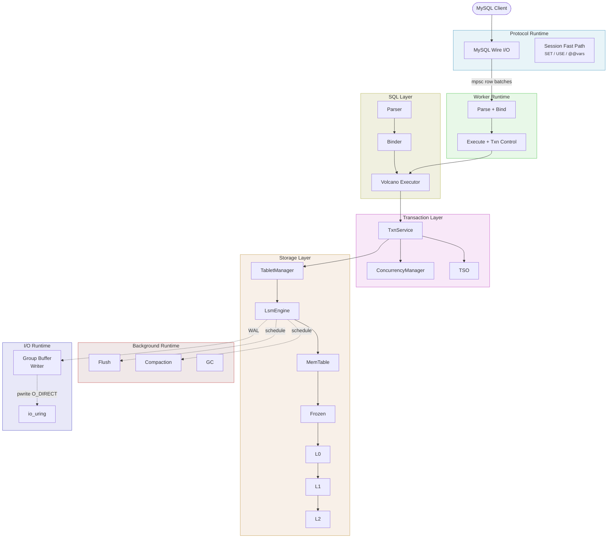
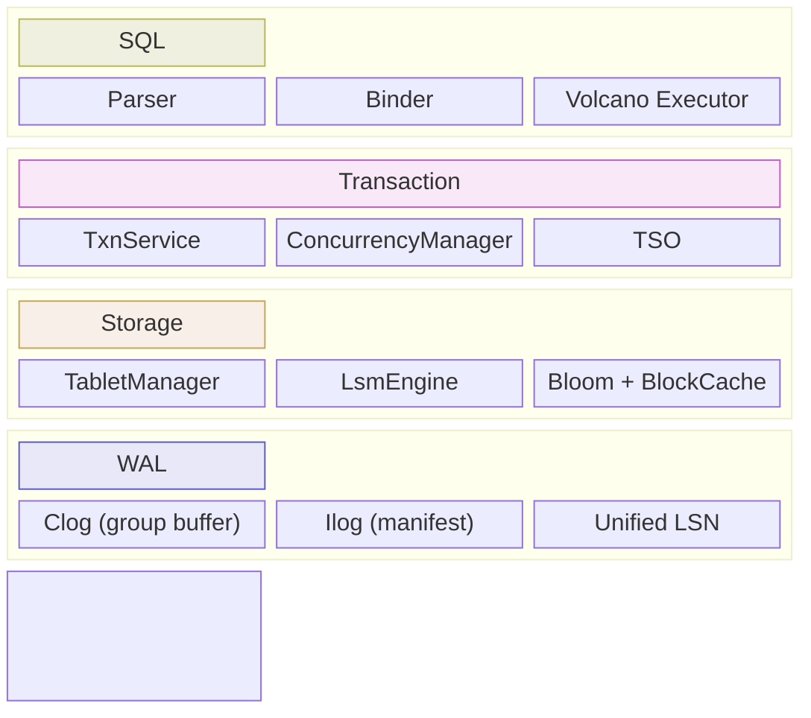

# TiSQL

A MySQL-compatible SQL database in Rust focused on correctness-first transaction semantics and practical storage-engine design.

[](https://github.com/cfzjywxk/tisql/actions/workflows/ci.yml)
[](LICENSE)

## Design Highlights

- **MySQL wire protocol** — standard MySQL clients connect on port 4000 (`opensrv-mysql`)
- **Non-blocking async commit** — protocol dispatches to worker runtime via oneshot; worker yields at clog fsync (no thread blocked waiting for disk); writer thread batches and flushes with `O_DIRECT|O_SYNC` — the entire commit path is async end-to-end, with worker threads never blocking on I/O
- **4-runtime architecture** — physical thread isolation between protocol, worker, background, and I/O runtimes
- **OceanBase-style group buffer WAL** — preallocated circular buffer with slot reservations, zero-copy serialization directly into ring, single writer thread via `spawn_blocking` with `O_DIRECT|O_SYNC` pwrite
- **Snapshot isolation with pessimistic locking** — lock-on-write, `commit_ts` computed after locks acquired
- **LSM storage** — bloom filters, block cache, `io_uring` (Linux), per-tablet engines
- **Unified LSN** — clog + ilog share a single LSN provider for consistent recovery ordering

## Architecture



## Component Layers



| Layer | Components | Key Details |
|-------|-----------|-------------|
| **SQL** | Parser → Binder → Executor | Volcano-style operator tree, streaming row batches |
| **Transaction** | TxnService + ConcurrencyManager + TSO | Snapshot isolation, pessimistic locking, `max_ts` tracking |
| **Storage** | TabletManager → LsmEngine | MemTable → Frozen → L0 → L1 → L2, bloom filters, block cache |
| **WAL** | Clog + Ilog + LsnProvider | Group buffer writer (`O_DIRECT\|O_SYNC`), manifest checkpoints |

## Quick Start

```bash
cargo run                                    # start server
mysql -h127.0.0.1 -P4000 -uroot test        # connect
```

```sql
CREATE TABLE users (id INT PRIMARY KEY, name VARCHAR(100), age INT);
INSERT INTO users VALUES (1, 'Alice', 25), (2, 'Bob', 30);
BEGIN;
UPDATE users SET age = age + 1 WHERE id = 1;
COMMIT;
SELECT id, name, age FROM users ORDER BY id;
```

## SQL Coverage

| Category | Statements |
|----------|-----------|
| **DDL** | `CREATE TABLE [IF NOT EXISTS]`, `DROP TABLE [IF EXISTS]` |
| **DML** | `INSERT`, `UPDATE`, `DELETE` |
| **Query** | `SELECT` with expressions, `WHERE`, `ORDER BY`, `LIMIT/OFFSET`, aggregates (`COUNT/SUM/AVG/MIN/MAX`) |
| **Session** | `USE`, `BEGIN`, `START TRANSACTION`, `COMMIT`, `ROLLBACK` |
| **SHOW** | `SHOW DATABASES`, `SHOW TABLES`, `SHOW WARNINGS`, `SHOW STATUS` |

> **Notes:** Tables require a `PRIMARY KEY`. `JOIN` and `GROUP BY` are not yet implemented. Prepared statement hooks exist but execution is stubbed.

## Performance Snapshot

Benchmark: go-ycsb insert-only, `recordcount=100k`, `operationcount=300k`, 16 threads, COM_QUERY path.

| Configuration | TiSQL | MySQL 8.0 |
|--------------|-------|-----------|
| **Strict durability** (`fsync` + binlog + doublewrite) | **~20.7k OPS** | ~7.4k–7.8k OPS |
| **InnoDB-only** (binlog disabled, doublewrite ON) | — | ~13.5k OPS |

> TiSQL config: `--clog-sync-mode full` (group buffer WAL).
> MySQL config: `innodb_flush_log_at_trx_commit=1`, `sync_binlog=1`, `log_bin=ON`, `innodb_doublewrite=ON`.

<details>
<summary><strong>Server Options</strong></summary>

```
-H, --host <HOST>            Host address (default: 127.0.0.1)
-P, --port <PORT>            Port (default: 4000)
-D, --data-dir <DATA_DIR>    Data directory (default: data)
-L, --log-level <LEVEL>      trace/debug/info/warn/error (default: info)
--clog-sync-mode <MODE>      full|data (default: full)
--group-commit-delay-us <N>  Group commit delay in µs (default: 0)
--group-commit-no-delay-count <N>
                             Skip delay at batch size N (default: 16)
--protocol-threads <N>       Protocol runtime threads
--worker-threads <N>         Worker runtime threads
--bg-threads <N>             Background runtime threads
--io-threads <N>             I/O runtime threads
--flush-threads <N>          Per-tablet flush threads
```

</details>

## Development

```bash
cargo build                              # debug build
cargo build --release                    # release build
make prepare                             # fmt + clippy + tests (quality gate)
```

**Test strategy:** run targeted tests first, full suite as final gate.

```bash
# targeted tests
cargo test storage::lsm::tests
cargo test --test store_test
cargo test --test mysql_protocol_test

# e2e (mysql-test style)
cargo run --bin mysqltest-runner -- --all

# failpoint tests
cargo test --test concurrency_test --features failpoints

# sysbench-like benchmark
cargo run --release --bin sysbench-sim -- --threads 8 --time 60
```

> **macOS:** development supported with sync I/O fallback. Store tests run single-threaded via `make` on macOS.

<details>
<summary><strong>Project Structure</strong></summary>

```
src/
├── lib.rs           # Database entry point and wiring
├── main.rs          # CLI server binary
├── catalog/         # MVCC catalog (inner-table-backed)
│   └── types.rs     # SQL data/value/type definitions
├── inner_table/     # Bootstrap, core system tables, GC worker
├── sql/             # Parser, binder, logical plan
├── executor/        # Volcano-style executor
├── transaction/     # TxnService, concurrency manager, txn state
├── tablet/          # LSM engine, memtable, SST, recovery
├── log/             # Durability logs
│   ├── clog/        # WAL with group buffer writer
│   ├── ilog.rs      # Manifest/flush/compaction metadata log
│   └── lsn.rs       # Shared LSN allocator for clog/ilog
├── protocol/        # MySQL wire protocol handler
├── worker/          # Worker dispatch + row batch streaming
├── session/         # Per-connection session state
├── tso/             # Local timestamp oracle
├── util/            # Shared utilities
│   ├── error.rs     # Shared error definitions
│   ├── codec/       # TiDB-compatible key/row codec
│   ├── io/          # IoFuture/IoService and DMA file abstractions
│   └── ...          # Logging, fs utils, timing, arena, etc.
```

</details>

## License

Licensed under the Apache License, Version 2.0. See [LICENSE](LICENSE) for details.
